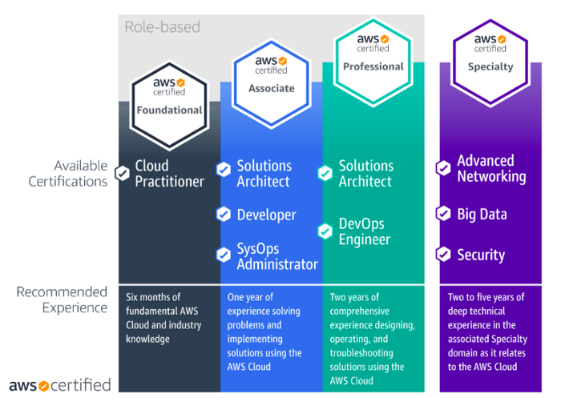

# Learning Cloud: Source Code Collection
## By Dwi Fahni Denni (@zeroc0d3)

### Road to AWS Certification

### Infrastructure As Code (IaC)
Infrastructure as code (IaC) is the process of managing and provisioning computer data centers through machine-readable definition files, rather than physical hardware configuration or interactive configuration tools.[1]() The IT infrastructure managed by this comprises both physical equipment such as bare-metal servers as well as virtual machines and associated configuration resources. The definitions may be in a version control system. It can use either scripts or declarative definitions, rather than manual processes, but the term is more often used to promote declarative approaches.

---
[1](1) Wittig, Andreas; Wittig, Michael (2016). Amazon Web Services in Action. Manning Press. p. 93. ISBN 978-1-61729-288-0.
